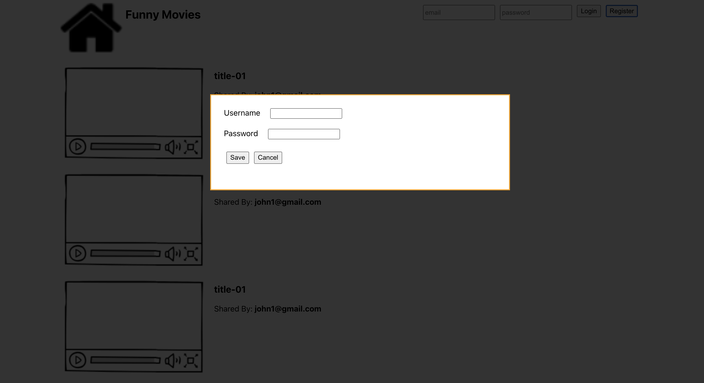
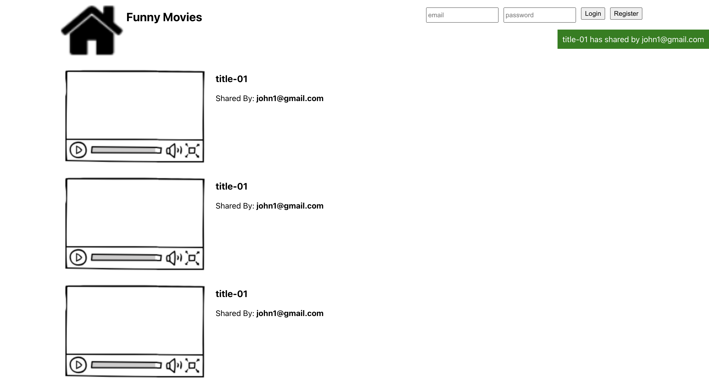
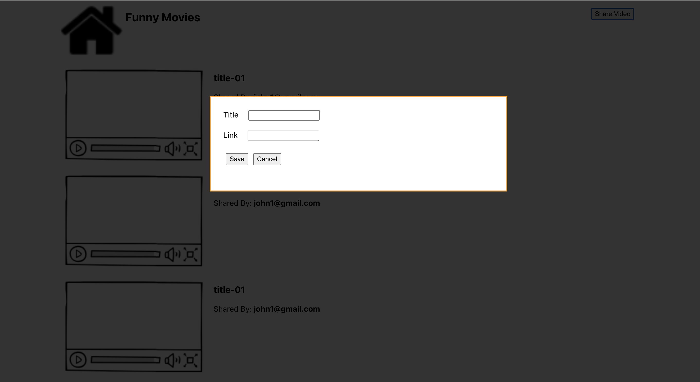

Introduction:
    Website for sharing the url link of members.

    Register user 
    

    List shared videos
    

    Share video and notification
    

    Version control: 
        - Git

    Frontend
        - include 1 page and 3 popup (register, sharing, notification)
        - react hook
        - responsive design
    Backend consist of
        - 4 api (login, register, sharing and get videos) 
        - jest unit test, jest test (integration)
        - socketio
        - bull background job

Prerequisites: 
    - Nodejs version 14 or higher
    - React 
    - Docker 

Installation & Configuration: 
    Step-by-step instructions for cloning the repository
        git clone https://github.com/daocuong11/sharing-video.git

    installing dependencies
        - go to directory sharning-video-api and run command "npm i"
        - go to directory sharning-video-fe and run command "npm i"

    configuring settings
        BE: go to directory sharning-video-api/app.module.ts and change mongodb, redis connection
        FE: change the root url in App.tsx, socket.ts, Head.tsx, RegisterPopup and SharedPopup 

Database Setup:
    - I used the mongodb to help easier to skip the migration 

Running the Application: 
    How to start the development server 
        docker
           - go to directory sharning-video and run command "docker-compose up"

        without docker 
           - run redis 
           - run mongodb
           - go to directory sharning-video-api and run command "npm start"

        
    How access the application in a web browser
        go to directory sharning-video-fe and run command "npm i", then run "npm start"
    
    How run the test suite
        go to directory sharning-video-api and run command "npm i", then run "npm test"

Docker Deployment: 
    - Add more nginx image then config storage path for frondend and revert proxy for backend 

Usage:
    Unregisted user: 
        - can visit the website and view shared videos.
        - can see the notification when new video is shared
        - can click button register, then provide username and password to create account
    Unregisted user: 
        - can visit the website and view shared videos.
        - can see the notification when new video is shared
        - can share new link to website

Troubleshooting: 
    - Project have not used the env so we need to change the connections tring of mongodb to start it with docker
    - FE Validation only implement in simple way to maybe still have some case unawared of validation
